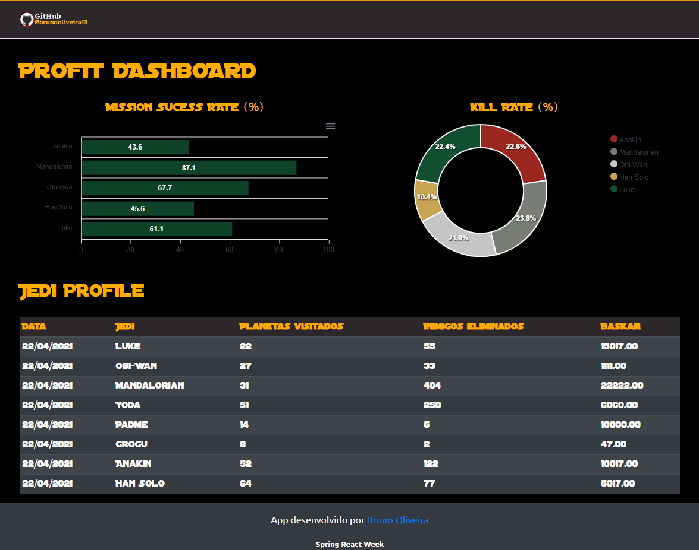

<h1 align="center">
    Mission Dashboard
</h1>


<p align="center">
  <a href="#-tecnologias">Tecnologias</a>&nbsp;&nbsp;&nbsp;|&nbsp;&nbsp;&nbsp;
  <a href="#-projeto">Projeto</a>&nbsp;&nbsp;&nbsp;|&nbsp;&nbsp;&nbsp;
  <a href="#memo-licença">Licença</a>
</p>


<p align="center">
 


  
</p>

<br>

<p align="center">
    
</p>

<br>


## 🚀 Tecnologias

Esses códigos foram desenvolvidos utilizando as seguintes tecnologias/frameworks/libs:

- [Java 11](https://docs.oracle.com/en/java/javase/11/docs/api/index.html)

- [ReactJS](https://reactjs.org)

- [Spring Boot 2.4.5](https://spring.io/projects/spring-boot)

- [Bootstrap 5](https://getbootstrap.com)

- [PostgreSQL](https://www.postgresql.org)

- [IntelliJ IDEA](https://www.jetbrains.com/idea/)

- [Postman](https://www.postman.com)

- [Netlify](https://docs.netlify.com)

- [Heroku](https://devcenter.heroku.com/start)

  <br>


## 💻 Projeto

🚀 O projeto consistuiu em criar um Dashboard com as tecnologias mais demandadas do mercado e o repositório tem como propósito compartilhar o conhecimento absorvido juntamente com os códigos desenvolvidos na 3ª Semana Spring React proporcionado pela DevSuperior.

👾  O projeto frontend e backend foi salvo neste monorepo, que consistiu inicialmente em montar o visual estatico (que se tornou dinâmico na integração), depois implementar o back end, seguindo um modelo de domínio e estruturação no padrão de camadas para implementar uma consulta paginada e consultas agrupadas para gráficos, e por fim fazendo a integração do back end e front end. 

⚡️ Caso queira ver o Dashboard funcionando, foi feito o deploy no Netlify. [Clique aqui para conferir.](https://brunooliveira-dsdash.netlify.app/)

:blue_heart: Caso queria testar localmente:

*  ``` git clone https://github.com/BRUNOOLIVEIRA13/Projeto-DSDash.git ```

* ``` yarn install ```

* Execute ``` yarn start ```  dentro da página frontend

  

📫 Espero que gostem, qualquer dúvida ou sugestão me encontro a disposição! [LinkedIn](https://www.linkedin.com/in/brunooliveira13/)

<br>


## :memo: Licença

Esse projeto está sob a licença MIT. Veja o arquivo [LICENSE](LICENSE.md) para mais detalhes.

---

Códigos feitos com ♥ by Bruno Oliveira durante a semana Spring React da [DevSuperior](https://devsuperior.com.br). :blue_heart: 

<br>
